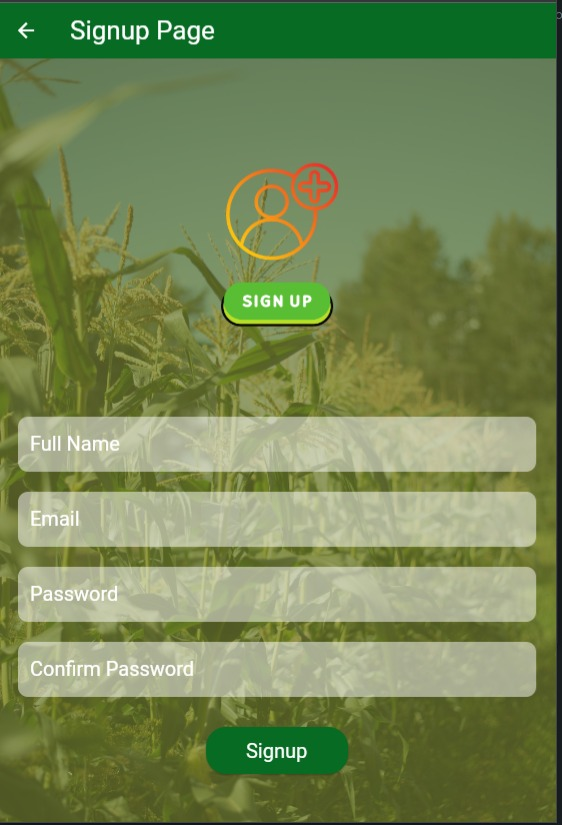
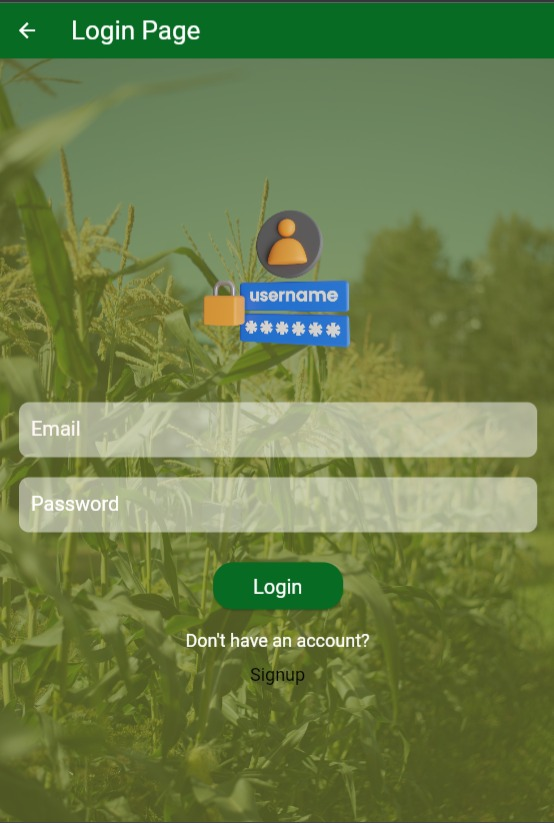

# Maize Plant Disease Detection Mobile App


A Flutter-based mobile application for Maize Plant Disease Detection using Convolutional Neural Networks (CNN). This app provides a comprehensive solution for identifying maize plant diseases, their symptoms, treatments, generating PDF reports, and enabling user feedback to administrators.

## Features

- **Firebase Signup & Sign-In:** Securely register and log in with your email and password.

- **Image Pick & Capture:** Easily choose images from the gallery or capture them using the in-app camera.

- **Disease Identification:** Utilizes a CNN model to identify maize plant diseases and provide information about them.

- **Symptoms and Treatments:** Detailed information about the symptoms and suggested treatments for identified diseases.

- **PDF Report Generation:** Create PDF reports with disease images and relevant details.

- **Feedback to Admin:** Provide feedback to administrators to help improve the app.

- **Contributors:** [Udit Mahato](github/uditmahato)

- **Screenshots:** (Insert app screenshots here)

- **And Much More:** Describe any other significant features or functionalities.

## Screenshots






## Getting Started

To run this Flutter application, follow these steps:

1. **Clone the Repository:**

    ```bash
    git clone https://github.com/uditmahato/api_maize_plant_disease.git
    cd api_maize_plant_disease
    ```

2. **Firebase Configuration:**

    - Create a new Firebase project on the [Firebase Console](https://console.firebase.google.com/).
    - Configure Firebase for your app and download the `google-services.json` file.
    - Place the `google-services.json` in the `android/app` directory.
    - Add the necessary Firebase SDK dependencies to your `android/app/build.gradle` and `android/build.gradle` files.

3. **Flutter Dependencies:**

    Run the following command to install Flutter dependencies:

    ```bash
    flutter pub get
    ```

4. **Run the App:**

    Use the following command to run the app on an emulator or connected device:

    ```bash
    flutter run
    ```

## Configuration

You will need to configure the Firebase project with your own settings. Make sure to update the Firebase configuration files and adjust the app's Firebase settings as needed.

## Contributing

Contributions are welcome! If you'd like to improve this project, please open an issue or submit a pull request with your changes.

## License

This project is licensed under the MIT License - see the [LICENSE](LICENSE) file for details.

## Show Your Support

If you find this project useful, please consider giving it a star on GitHub to show your support.

[](https://github.com/uditmahato/api_maize_plant_disease)

Your support is greatly appreciated!

## Acknowledgments

- Thanks to the Flutter and Firebase communities for their valuable resources and documentation.
